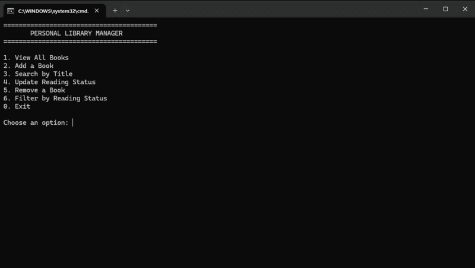
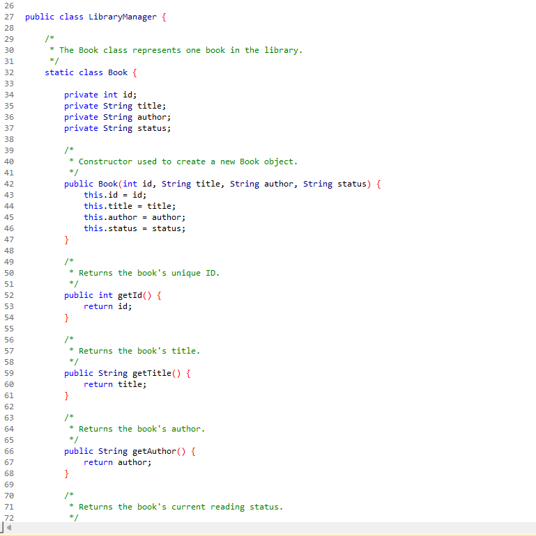
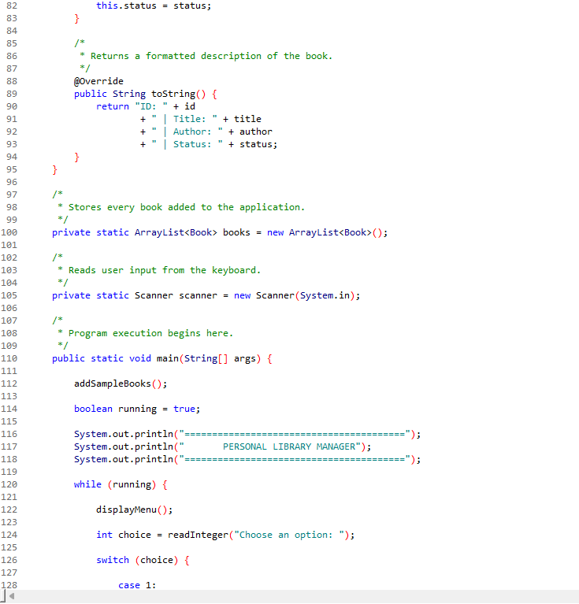

# 📚 Personal Library Manager

A console-based Java application that allows users to organize and manage a personal library. This project was built to strengthen my understanding of object-oriented programming, collections, user input validation, and menu-driven application design.

---

# 🎬 Application Demo

<p align="center">
    
</p>

---

# 📖 Overview

Personal Library Manager allows users to create and organize a collection of books through an interactive command-line interface. Users can add books, search by title, update reading status, remove books, and filter books based on their reading progress.

This project demonstrates clean Java programming practices while applying object-oriented design principles and efficient data management using ArrayLists.

---

# 🛠 Technologies Used

- Java
- Object-Oriented Programming (OOP)
- ArrayList Collections
- Scanner (User Input)
- Exception Handling
- Input Validation
- Command Line Interface (CLI)

---

# ✨ Features

- 📚 View all books
- ➕ Add new books
- 🔍 Search books by title
- ✏ Update reading status
- ❌ Remove books
- 📖 Filter books by reading status
- ✔ Input validation
- ✔ Object-oriented design
- ✔ Menu-driven interface

---

# 🏗 Project Structure

The project consists of two primary classes:

### Book Class

Represents a single book and stores:

- Book ID
- Title
- Author
- Reading Status

The Book class demonstrates encapsulation by storing data in private variables while exposing only the necessary methods.

---

### LibraryManager Class

Controls the application's functionality by:

- Displaying the menu
- Processing user input
- Managing the book collection
- Searching books
- Updating reading status
- Removing books
- Filtering books

---

# 📸 Code Preview

## Object-Oriented Book Class

The application uses a dedicated Book class to represent each book as an object with its own properties and behavior.



---

## Menu-Driven Program Structure

The application follows a structured menu system that separates functionality into reusable methods, making the program easy to understand and maintain.



---

# 💡 What I Learned

Through this project I gained experience with:

- Designing classes using object-oriented principles
- Working with Java collections
- Building menu-driven applications
- Managing program flow using methods
- Implementing search algorithms
- Validating user input
- Creating maintainable and readable code
- Writing reusable methods
- Debugging Java applications

---

# 🚀 Future Improvements

Possible enhancements include:

- Save library to a file
- Load saved books automatically
- Sort books by title or author
- Add publication year
- Add book genres
- Add ISBN support
- Export library to CSV
- Improve search with partial matches

---

# ▶ Running the Project

### Requirements

- Java JDK 17 or newer

### Compile

```bash
javac LibraryManager.java
```

### Run

```bash
java LibraryManager
```

---

# 👨‍💻 About Me

I'm Caleb Gandee, an entry-level Software Developer passionate about building practical applications and continuously improving my programming skills.

I enjoy developing software that solves real-world problems while writing clean, organized, and maintainable code.

I'm currently seeking opportunities as a **Software Developer** where I can contribute, continue learning, and grow as part of a development team.

---

Thank you for checking out my project!
